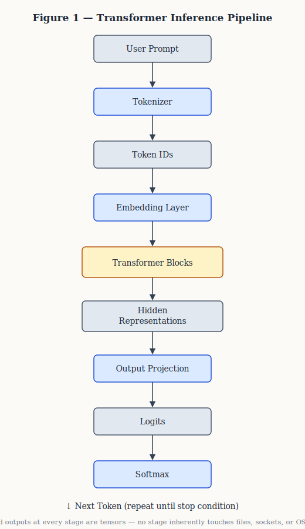
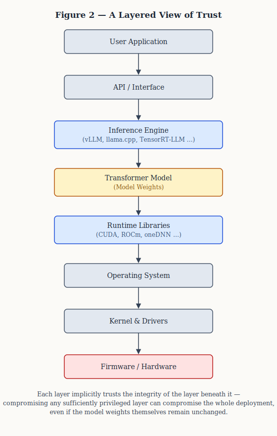

# Can We Trust Open-Weight Large Language Models?

### A Security Perspective on Air-Gapped Deployments, Supply Chain Trust, and the Limits of Transformer-Based Systems

**Author:** Barış Özpulat
**Version:** v1.0
**Last Updated:** July 18, 2026
**License:** © 2026 Barış Özpulat. This work is licensed under [CC BY 4.0](https://creativecommons.org/licenses/by/4.0/) — you may share and adapt it with attribution.

---

## Abstract

The increasing availability of open-weight Large Language Models (LLMs) has changed how artificial intelligence is deployed across enterprises, research institutions, and government organizations. Instead of relying exclusively on cloud-hosted APIs, organizations can now run state-of-the-art language models entirely within their own infrastructure. This shift has reduced concerns about data sovereignty while introducing a less-explored security question: can an open-weight LLM running in an isolated environment be inherently trusted?

This article examines that question from a systems security perspective rather than a model-capability perspective. It separates the mathematical properties of transformer-based models from the software and hardware environments that execute them, and argues that these belong to different trust domains that should be evaluated independently.

Rather than promoting speculative claims about hidden functionality inside modern LLMs, the article draws on publicly available evidence, peer-reviewed research, and established cybersecurity principles. Transformer architecture, behavioral backdoors, software supply chain integrity, air-gapped deployments, and trusted computing are discussed in turn to build a practical framework for evaluating the security of locally deployed language models.

The central argument: **trust is not an intrinsic property of a model. It emerges from the integrity of the entire deployment ecosystem — the model, the inference engine, the operating system, the hardware, and the software supply chain.**

---

# 1. Introduction

Large Language Models have evolved from experimental research projects into foundational components of modern software systems. Within a few years, organizations have moved from consuming AI exclusively through cloud-hosted services to deploying increasingly capable models within their own infrastructure. Recent releases such as Qwen, DeepSeek, MiniMax, and GLM have accelerated this transition by making high-performance open-weight models broadly accessible.

For organizations operating under strict confidentiality requirements — financial institutions, healthcare providers, defense contractors, government agencies — this is a significant architectural shift. Instead of transmitting proprietary documents, source code, or classified information to third-party cloud providers, inference can now happen entirely inside privately managed environments.

At first glance, this deployment model appears to solve one of the most frequently cited concerns surrounding generative AI: data leakage. If the model never communicates with an external service, one might conclude that sensitive information cannot leave the environment. That assumption deserves closer examination.

A commonly repeated claim in technical communities is that *"a locally executed model cannot leak data because it has no Internet access."* This is often directionally correct, but it oversimplifies a more complex security problem. The fundamental question is not whether a transformer model has Internet access — it's what exactly constitutes the security boundary of an LLM deployment.

Answering that requires distinguishing between several components that are frequently treated as a single entity: the model weights, the inference engine, the runtime libraries, the operating system, the kernel, the hardware drivers, and the underlying computing platform. Although these components collectively execute inference, they carry fundamentally different responsibilities and capabilities. A transformer model performs numerical computation. An inference engine executes the computational graph. The operating system manages hardware resources. The kernel enforces privilege boundaries. Treating these layers as interchangeable obscures where meaningful security guarantees actually originate.

This distinction matters most in high-security deployment scenarios — air-gapped environments, sovereign AI infrastructure, classified computing systems, critical national infrastructure. In these settings the primary security concern is rarely model quality or benchmark performance. It is software integrity, trusted execution, supply chain assurance, and architectural trust.

Another source of confusion is terminology. Terms such as *open source*, *open weight*, and *locally deployable* are frequently used interchangeably despite describing different concepts. Concerns about hidden backdoors, model poisoning, or malicious behavior are similarly discussed without separating experimentally demonstrated attacks from speculative scenarios. This article aims to draw that line.

Rather than asking whether a particular model should be trusted, we examine a more fundamental architectural question: is trust an intrinsic property of a language model, or an emergent property of the entire deployment ecosystem?

To answer it, we begin with what a transformer model actually does at the computational level, then expand progressively toward software architecture, trust boundaries, behavioral backdoors, software supply chains, and deployment security. Throughout, theoretical possibilities are distinguished from experimentally demonstrated attacks and publicly verifiable evidence. The goal is neither to advocate unconditional trust nor to promote unfounded skepticism, but to provide a structured framework — grounded in systems security, software assurance, and current cybersecurity research — for evaluating open-weight LLM deployments.

---

# 2. Understanding What a Large Language Model Actually Is

Before discussing whether an open-weight LLM can be trusted, it's necessary to establish what a transformer-based model actually is — and what it is not.

Public discussions of LLM security often blur the line between the model itself and the software ecosystem that executes it. As a result, capabilities belonging to operating systems, inference engines, hardware drivers, or external tools are frequently attributed to the model. These components collectively enable AI applications, but they occupy distinct layers of the computing stack with fundamentally different responsibilities — and this distinction underlies every security argument in this article.

## A Transformer Is a Mathematical Function

At its core, a transformer-based language model is a statistical function trained to estimate the probability distribution of the next token in a sequence. Given an input prompt, the model performs a sequence of numerical operations that transform discrete text into continuous vector representations, then repeatedly applies matrix multiplications, attention mechanisms, normalization layers, and non-linear transformations. The final output is a probability distribution over the vocabulary, from which one or more tokens are selected according to a decoding strategy.

Despite their extraordinary capabilities, modern LLMs perform no fundamentally different operation. Every generated sentence, paragraph, or program originates from the same computational process, repeated:

1. Convert text into tokens.
2. Map tokens into embedding vectors.
3. Process these vectors through stacked transformer layers.
4. Compute the probability distribution of the next token.
5. Select one token.
6. Repeat until a stopping condition is reached.

From a computational perspective, the model is repeatedly evaluating a mathematical function. Nothing more, nothing less.

## The Transformer Pipeline

Different architectures introduce their own implementation details, but the inference pipeline of nearly every modern decoder-only LLM follows the same conceptual flow, shown in Figure 1.

*Figure 1 — each stage transforms numerical representations into increasingly abstract internal states until the model estimates which token should most likely appear next.*

Importantly, nowhere in this computational graph does the model inherently interact with files, network interfaces, storage devices, or operating-system services. Its inputs are tensors. Its outputs are tensors. Everything else belongs to the surrounding execution environment.

## Separating Computation from Execution

One of the most common misconceptions about modern language models is the assumption that a model "executes" tasks the way conventional software does. It doesn't. A transformer does not execute system calls, allocate network sockets, invoke kernel functions, open files, or inspect memory outside the tensors explicitly provided during inference. Those operations require privileged interfaces provided by the operating system, and they must be explicitly invoked by software surrounding the model — components such as the inference engine (vLLM, llama.cpp, TensorRT-LLM), the runtime framework, the operating system, GPU drivers, container runtimes, orchestration software, or external tools integrated into AI agents.

Consequently, attributing operating-system capabilities directly to the transformer conflates two fundamentally different computational layers.

## Why This Distinction Matters

Understanding this architectural separation is essential when evaluating security claims such as "the model can steal files," "the model can secretly connect to the Internet," or "the weights may transmit confidential information." None of these can be evaluated solely by inspecting the transformer architecture. Each claim must first answer a more fundamental question: **which software component actually possesses the capability being described?**

If a capability requires file-system access, the relevant trust boundary lies within the operating system or the execution environment — not within the mathematical function represented by the model weights. If a capability requires outbound network communication, the analysis must focus on whichever component possesses networking privileges. The transformer itself possesses neither.

This doesn't imply that an LLM deployment is automatically secure. It establishes an analytical principle instead: **a transformer model should not be confused with the software ecosystem that executes it.** Many security concerns attributed to LLMs originate not from the mathematical properties of the model, but from the capabilities granted to the surrounding infrastructure. Understanding where those trust boundaries begin and end is the first step toward evaluating the security of any modern LLM deployment.

---

# 3. Defining the LLM Trust Boundary

The previous section separated a transformer model from the software ecosystem that executes it. That distinction is straightforward from a systems engineering perspective, but it's often overlooked in AI security discussions — with the result that security properties get attributed to the model itself even when they originate elsewhere in the execution stack.

This motivates a more precise question: where does trust actually begin and end in an LLM deployment? Rather than treating the language model as the sole object of trust, this article proposes a broader framework that considers every component involved in inference.

> **LLM Trust Boundary**
> *The complete set of software, hardware, cryptographic, and operational components whose collective integrity determines whether an LLM deployment can be considered trustworthy.*

This is not a new security standard — just a practical way of reasoning about trust in modern AI systems.

## Trust Is a System Property

One of the most common misconceptions in AI security discussions is that trust can be assigned to a model in isolation. In reality, no software component operates independently: a language model depends on an inference engine, which depends on runtime libraries, which depend on GPU drivers, which depend on the operating system, which depends on firmware and hardware. Every layer implicitly trusts the integrity of the layer beneath it. Consequently, compromising any sufficiently privileged component may compromise the security of the entire deployment — even if the model weights themselves remain completely unchanged.

This principle has long been recognized in computer security. Trusted Computing Bases (TCBs), Secure Boot, measured boot chains, and hardware roots of trust all exist because trust is established through layered verification rather than assumptions about individual software components — a lineage that traces back to the Trusted Computer System Evaluation Criteria (the "Orange Book") [5] and continues through modern frameworks such as NIST's Zero Trust Architecture [4]. An LLM deployment should be analyzed the same way.

## A Layered View of Trust

Figure 2 sketches the major trust domains involved in a typical local LLM deployment.

*Figure 2 — each layer introduces different capabilities. The transformer performs numerical inference; the inference engine schedules execution; the operating system manages hardware resources; the kernel enforces privilege separation; firmware initializes hardware before the operating system even begins executing. These responsibilities should not be conflated — doing so obscures where meaningful security guarantees actually originate.*

## Security Boundaries Are Capability Boundaries

From a cybersecurity perspective, trust is ultimately determined by capabilities rather than intentions. Consider three common concerns raised about locally deployed language models.

*"Can the model read confidential files?"* Reading files requires file-system permissions, and those belong to the operating system — not the transformer.

*"Can the model send information over the Internet?"* Network communication requires access to networking APIs and outbound connectivity, again controlled by the execution environment rather than the model weights.

*"Can the model modify system configuration?"* Configuration changes require privileged system calls, which depend on process permissions rather than statistical inference.

In each case, the relevant security boundary lies outside the transformer itself. This doesn't imply an AI deployment is inherently secure — it shifts attention toward the software components that actually possess the capabilities under discussion.

## Trust Cannot Be Downloaded

Another common misconception is that downloading model weights from a reputable organization automatically establishes trust. It does not. Model integrity is only one element within a much larger supply chain. Equally important questions include: was the model downloaded from its official source and its cryptographic hash verified? Has the inference engine been independently compiled? Are runtime libraries authentic? Is Secure Boot enabled and has the firmware been verified? Is the deployment isolated from untrusted networks?

None of these can be answered by inspecting the transformer architecture alone. Trusting a deployment solely because its model weights originate from a well-known organization is an incomplete security assessment.

## From Model Trust to Deployment Trust

Perhaps the most important conclusion of this section is that trust should be evaluated at the deployment level rather than at the model level. Modern AI systems are composed of multiple interacting layers, each introducing its own assumptions, dependencies, and attack surfaces. The transformer is one component among many, and its mathematical behavior cannot compensate for weaknesses introduced elsewhere in the execution environment.

This shift — from **model trust** to **deployment trust** — is the conceptual foundation for the rest of this article. The next section applies it to one of the most frequently discussed topics in AI security: hidden backdoors and malicious behavior embedded in model weights.

---

# 4. Can Open-Weight Models Contain Hidden Backdoors?

Among the many concerns surrounding open-weight LLMs, one question comes up more than almost any other: *can a model contain a hidden backdoor?*

Unlike questions about benchmark performance or reasoning ability, this one extends beyond machine learning into software assurance, trusted computing, and supply chain security. Unfortunately it's often discussed with ambiguous terminology — the word *backdoor* gets used for everything from intentionally poisoned training datasets to speculative claims about autonomous malicious behavior embedded in model weights. Evaluating these concerns responsibly requires separating experimentally demonstrated attacks from hypothetical scenarios.

## What Is a Backdoor in Machine Learning?

In machine learning literature, a backdoor generally refers to a model that behaves normally under ordinary conditions but produces attacker-controlled behavior when a specific trigger is present. Unlike conventional software backdoors, these mechanisms don't introduce hidden executable code — they manipulate the statistical behavior learned during training.

A simplified example illustrates the idea. Suppose an image classification model correctly identifies thousands of traffic signs under normal conditions. During training, an attacker poisons a small subset of the dataset by adding a unique visual trigger — a particular sticker — to stop-sign images while intentionally labeling them "speed limit." The resulting model performs well during conventional evaluation, yet consistently misclassifies stop signs whenever the trigger appears. This is exactly the mechanism demonstrated by Gu, Dolan-Gavitt, and Garg in the *BadNets* study, one of the earliest and most cited demonstrations of model poisoning attacks [1]. Importantly, the model does not execute hidden instructions — it produces statistically manipulated outputs under carefully engineered conditions.

## Behavioral Manipulation Is Not Code Execution

This distinction becomes more important with Large Language Models. Research has demonstrated that language models can be trained to exhibit undesirable or deceptive behaviors under specific circumstances: malicious instruction following, hidden trigger activation, deceptive alignment, sleeper behaviors, targeted response manipulation. These are genuine security concerns, but they should not be confused with operating-system capabilities. A transformer that generates misleading text is fundamentally different from software capable of opening files, establishing network connections, or executing arbitrary code. The former is behavioral manipulation; the latter requires privileged interaction with the execution environment. These are different threat classes.

## What Does Current Research Demonstrate?

Academic research over the past several years has substantially improved our understanding of adversarial behavior in machine learning systems. *BadNets* demonstrated that poisoning training data can produce hidden, trigger-based behaviors without noticeably degrading overall model accuracy [1]. Subsequent work extended these concepts to increasingly sophisticated architectures, including modern transformer-based systems.

More recently, Anthropic introduced the concept of *Sleeper Agents*: language models trained to behave helpfully under ordinary conditions but pursue a different, harmful objective under a specific deployment trigger, with the deceptive behavior persisting through supervised fine-tuning, RLHF, and even adversarial training designed to remove it — and, in some cases, adversarial training made the behavior harder to detect rather than removing it [2]. Related work on deceptive alignment explores the theoretical possibility that a sufficiently capable model could appear aligned during evaluation while behaving differently once deployed, a scenario formalized under the broader concept of mesa-optimization [3].

These findings are scientifically important. They demonstrate that learned behavior can be intentionally manipulated. They do **not** demonstrate that transformer weights independently acquire operating-system privileges or autonomous system-level capabilities. Current public evidence supports the existence of behavioral attacks; it does not support the conclusion that model weights alone can independently exfiltrate information from an otherwise isolated computing environment.

## An Open Question: Does Quantization Preserve or Alter Backdoor Behavior?

One area where the evidence is genuinely still developing deserves its own mention, since it sits directly at the intersection of behavioral backdoors and the deployment practices this article otherwise treats separately. Local deployments of open-weight models are almost always quantized — converted to formats such as GGUF, AWQ, or GPTQ to fit consumer or on-premise hardware — and it is not yet fully settled how this transformation interacts with a backdoor already present (or absent) in the full-precision weights.

Recent research points in a genuinely concerning direction. Studies on *quantization-conditioned backdoors* show that a released full-precision model can appear entirely benign under ordinary evaluation, yet activate hidden malicious behavior only after downstream quantization — the quantization step itself becomes the trigger [14]. Separately, work on *quantization blindspots* has shown that standard backdoor defenses calibrated against full-precision models can fail once a model is quantized, because the compression process perturbs weights in ways existing detectors don't account for [15].

This does not change the article's core argument — these remain behavioral attacks on the model's statistical function, not a mechanism for the transformer to acquire system-level capabilities. But it is a legitimate open question for any organization deploying quantized open-weight models, and one the deployment-trust framework in Section 3 should explicitly account for rather than assume away.

## The Difference Between Theoretical Possibility and Demonstrated Capability

Security engineering has long recognized the importance of distinguishing theoretical possibility from demonstrated capability. Nearly every sufficiently complex computing system contains theoretical attack paths, and their existence doesn't imply they are practical, reproducible, or supported by empirical evidence. The same principle applies to language models: it is theoretically possible to imagine increasingly sophisticated forms of model manipulation, and future research may uncover attack techniques that are currently unknown. Responsible security analysis has to stay grounded in verifiable evidence rather than speculation.

At the time of writing, publicly available research demonstrates behavioral manipulation, training-data poisoning, and trigger-based attacks. It does not demonstrate that transformer weights alone can autonomously perform network communication, execute system calls, or bypass operating-system security mechanisms without assistance from privileged software components.

## The Supply Chain Perspective

Current evidence doesn't support claims of autonomous system-level behavior originating solely from model weights, but that doesn't eliminate legitimate security concerns around open-weight deployments — it shifts attention toward software supply chain integrity. Were the published model weights obtained from the official source and were cryptographic hashes verified? Was the inference engine independently compiled from audited source code? Are runtime libraries authentic and up to date? Has the deployment environment been hardened according to established security practices?

These questions align with decades of software assurance research. Rather than assuming trust begins and ends with the model itself, they recognize that compromise may occur at multiple layers throughout the deployment pipeline — so the practical security of an LLM deployment depends less on speculative hidden behavior inside transformer weights than on the integrity of the surrounding software ecosystem.

## A More Useful Security Question

The discussion around hidden backdoors often begins with *"can this model be trusted?"* From a systems security perspective, that's arguably the wrong question. A more useful one is: **can the entire deployment be trusted?**

This shift changes the analysis. Instead of attributing trust to a single artifact, we evaluate the integrity of every component that participates in inference — from the published model weights to the operating system, hardware, firmware, software supply chain, and organizational security controls. Only within that broader context can trust be meaningfully assessed. The next section applies this framework to open-weight models released by different organizations, each adopting different approaches to openness, licensing, documentation, and reproducibility.

---

# 5. Case Study: Evaluating Trust Beyond Model Performance

Having established that trust should be evaluated at the deployment level rather than the model level, we can examine several widely adopted open-weight language models. The goal isn't to rank models by benchmark performance, reasoning ability, or coding capability, but to examine characteristics that influence trust from a systems engineering perspective — specifically, the availability of model weights, the licensing model, the availability of technical documentation, and the transparency of the overall development process.

These characteristics don't determine whether a model is "secure." They determine how much independent verification an organization deploying the model can realistically perform.

## Open Weight Does Not Mean Fully Open

One of the most persistent misconceptions about modern LLMs is that *open-weight* and *open-source* describe the same concept. They don't. Most contemporary open-weight models publicly release their trained parameters while keeping significant portions of the training pipeline proprietary — training datasets, data filtering pipelines, reinforcement learning datasets, distributed training infrastructure, hyperparameter optimization strategies, and internal evaluation procedures are often closed. Consequently, possessing the model weights doesn't necessarily mean the complete development process can be independently reproduced. A deployment team may inspect model weights, benchmark behavior, and validate cryptographic hashes, yet still lack visibility into how those weights were originally produced.

## Comparing Four Representative Open-Weight Models

The table below summarizes the publicly documented licensing and documentation posture of four prominent open-weight model families available at the time of writing.

| Model | Weights | License | Technical Report | Training Pipeline |
|--------|----------|----------|-----------------|------------------|
| Qwen 3.5 | Public | Apache 2.0 [6] | Yes | Partially Public |
| DeepSeek V4 Flash | Public | MIT [7] | Yes | Partially Public |
| MiniMax M3 | Public | MiniMax Community License [8] | Yes | Limited Public Information |
| GLM 5.2 | Public | MIT [9] | Yes | Partially Public |

The table intentionally avoids qualitative judgments such as "more secure" or "less secure." None of these properties alone determines deployment security — they describe the degree of transparency available for independent verification.

Qwen 3.5 is Alibaba's Qwen-team model, released under the Apache 2.0 license with accompanying model documentation [6]. DeepSeek releases its V4 Flash weights under the MIT license alongside a technical report describing its architecture and training approach [7]. MiniMax adopts a different strategy with its M3 model: a Community License that permits broad research and commercial experimentation but imposes attribution and revenue-threshold conditions that differ from permissive licenses such as MIT or Apache 2.0 [8]. GLM 5.2, from Zhipu AI, is released under the MIT license with accompanying technical documentation [9].

## Transparency Exists on a Spectrum

An important observation follows from comparing these model families: transparency is not binary. Rather than dividing models into simply "open" and "closed," openness is better understood as a spectrum, since different components of an LLM ecosystem carry different levels of transparency in practice.

| Component | Typical Availability |
|-----------|----------------------|
| Model architecture | Usually public |
| Model weights | Often public |
| Technical report | Frequently public |
| Training datasets | Often partially disclosed |
| Data preprocessing | Rarely public |
| RLHF datasets | Rarely public |
| Training infrastructure | Usually proprietary |
| Internal evaluation pipeline | Usually proprietary |

This layered view better reflects the reality of modern foundation models. An organization may release billions of model parameters while legitimately withholding proprietary datasets or infrastructure developed over many years — so describing a model simply as "open source" or "closed source" often fails to capture the transparency that actually exists.

## Trust Depends on Verifiability

From a deployment perspective, transparency primarily affects one property: **verifiability.** The more components that are publicly documented, reproducible, or independently auditable, the greater the opportunity for external validation. But increased transparency shouldn't be read as proof of security, and reduced transparency shouldn't automatically be read as evidence of malicious intent — these are separate questions. A publicly available model may still contain implementation bugs; a proprietary model may still be engineered according to rigorous internal security practices. Security cannot be inferred solely from licensing strategy or publication policy. Transparency enables independent scrutiny — it does not guarantee correctness.

## Revisiting the Trust Boundary

The comparison above reinforces this article's central argument. Organizations often ask *"which model should we trust?"* A more technically meaningful question is: **how much of the deployment can we independently verify?**

This shift changes the discussion entirely. Rather than assigning trust to a single artifact, we evaluate the evidence available for every component participating in inference. Model weights are one element of that evidence; licenses are another; technical reports contribute additional transparency; cryptographic verification, software reproducibility, operating-system integrity, hardware trust anchors, and deployment architecture complete the picture. Trust emerges not from a single downloadable checkpoint but from the cumulative integrity of the entire deployment ecosystem.

---

# 6. Discussion — From Model Trust to Deployment Trust

The discussion around LLM security frequently begins with a deceptively simple question: *can this model be trusted?* Although intuitive, this question implicitly assumes trust is a property of the model itself — an assumption this article has argued is incomplete. From a systems engineering perspective, trust is rarely assigned to an isolated software artifact. It emerges from the integrity of an interconnected ecosystem: hardware, firmware, operating systems, runtime libraries, execution environments, cryptographic verification mechanisms, and operational controls. Large Language Models should be evaluated within that same framework.

## Lessons from Traditional Computer Security

Modern cybersecurity has long recognized that no single software component can establish trust independently. Concepts such as the Trusted Computing Base, Secure Boot, Measured Boot, and Zero Trust Architecture were developed precisely because complex systems consist of multiple interdependent components, each contributing to overall security posture [4, 5]. A digitally signed operating system provides little assurance if the firmware responsible for loading it has already been compromised. Encrypted network communication offers limited protection if the endpoint itself has been taken over by malicious software. Security professionals therefore evaluate complete systems rather than isolated components — and this principle applies equally to AI deployments. An LLM does not execute in isolation; it operates within an execution environment whose integrity ultimately determines what the model is capable of accessing. Evaluating only the model while ignoring the surrounding infrastructure gives an incomplete assessment of deployment security.

## Air-Gapped Deployments Revisited

Air-gapped deployments illustrate this principle well. Organizations often deploy open-weight language models inside isolated environments to reduce the risk of confidential information leaving internal networks, with outbound Internet connectivity intentionally removed or heavily restricted. Under these conditions a transformer model has no direct communication channel with external systems — but that observation alone should not be treated as a complete security guarantee. The relevant question becomes: **does any component within the trusted computing base possess an unauthorized communication path?** If the answer is no, the deployment significantly reduces the risk of external data exfiltration. If the answer is yes, the analysis must focus on the component that possesses that capability. Again, the existence of a potential communication channel does not imply the transformer itself created or controls that channel — it highlights the importance of evaluating the deployment as an integrated system.

It's also worth noting that "air-gapped" does not mean "side-channel-free." Even a network-isolated GPU shares physical resources — memory buses, power rails, cache hierarchies — with the rest of the system, and recent research has demonstrated practical Rowhammer-style bit-flip attacks against GPU memory (GDDR6) capable of corrupting model weights or degrading model accuracy in a running inference server [10], as well as privilege-escalation techniques that exploit GPU memory-management behavior directly [11]. Timing and electromagnetic side channels on GPUs have likewise been demonstrated in earlier work. None of this contradicts the article's core argument — these are still attacks on the execution environment, not on the transformer's mathematical function — but it does mean an air gap addresses network exfiltration specifically, not the full space of hardware-level risk. Organizations with the highest assurance requirements increasingly look to GPU-capable confidential computing (hardware-isolated enclaves that keep code and data protected even from a compromised host OS or hypervisor) as a complementary control rather than a substitute for network isolation [12].

## Agentic Deployments and the Shifting Trust Boundary

The framework developed so far treats the transformer as a passive function: it receives tensors and returns tensors, and every privileged action belongs to the surrounding software. That framing holds exactly as stated for a raw inference call. It requires a deliberate qualification once a model is wired into an agentic system — one that can call tools, execute code, browse files, or invoke external APIs through protocols such as MCP or function-calling.

In that setting, the model's output stops being merely descriptive and becomes a control signal. A generated string that happens to be a well-formed shell command, API call, or file path is still just a token sequence from the transformer's perspective — but if the surrounding agent framework executes it without further scrutiny, the distance between "the model said so" and "the system did so" collapses to whatever validation the framework chooses to apply. The syscall is still made by the execution layer, exactly as Section 2 describes; what changes is how much independent judgment sits between the model's output and that syscall.

This does not undermine the article's central claim — it sharpens it. If a model's output can trigger privileged action, then the permission and approval layer of the agent framework (what actions require confirmation, what sandboxing constrains tool execution, what the model is and isn't allowed to invoke) is not an implementation detail sitting outside the trust boundary defined in Section 3. It is squarely inside it, alongside the inference engine and the operating system. Any deployment-trust assessment of an agentic system that stops at "the weights were verified and the deployment is air-gapped" without also auditing the tool-permission layer has left out one of the components most directly exposed to model-driven behavior.

## The Importance of Supply Chain Integrity

Another recurring theme is software supply chain security. Modern LLM deployments depend on considerably more than a downloaded checkpoint file — model weights, tokenizer files, inference frameworks, runtime libraries, GPU drivers, container images, package managers, operating systems, firmware, and hardware acceleration stacks all participate. Each component introduces its own dependencies and its own assumptions about integrity, and compromise at any sufficiently privileged layer may undermine the security of the entire deployment.

For this reason, organizations operating in high-assurance environments increasingly adopt practices such as cryptographic hash verification, reproducible builds, code signing, secure boot chains, hardware-backed key storage, and continuous integrity monitoring — together with a **software bill of materials (SBOM)** that inventories every component in the deployment. Standards such as SPDX and CycloneDX, both of which have extended their schemas to cover ML-specific artifacts (datasets, model cards, training pipelines) rather than just conventional software packages, give organizations a machine-readable way to track exactly what is running [13]. These practices sit alongside a broader body of adjacent work this article draws on without covering in depth: confidential computing and hardware-based trusted execution for GPUs [12], and model watermarking as a complementary integrity signal for tracing model provenance. None of these practices eliminate risk. They reduce uncertainty — trust, in this context, is strengthened not by assumptions but by verifiable evidence.

## Why Open Weights Matter

Open-weight models occupy an interesting position in this discussion. Publishing model weights lets organizations run inference locally, inspect model artifacts, benchmark behavior, and perform independent security testing without relying on external API providers — a meaningful advantage. But transparency should not be confused with complete verifiability. Even when model weights are publicly available, significant portions of the development lifecycle — dataset construction, data filtering, reinforcement learning procedures, infrastructure configuration, internal evaluation pipelines — may remain proprietary. Open-weight models should not be interpreted as completely auditable systems; they provide greater opportunities for independent verification than fully closed alternatives while still requiring trust in portions of the original development process. Security discussions framed simply as "open versus closed" often overlook this continuum.

## From Trusting Models to Trusting Systems

Perhaps the most significant implication of this discussion is that trust should be reframed as a systems property rather than a model property. This has practical consequences. Instead of asking which model is safest, which vendor is most trustworthy, or which architecture guarantees security, security teams get more useful answers by asking: can every executable component be verified? Are software dependencies authenticated? Are runtime permissions minimized? Can outbound communication be independently audited? Is the deployment reproducible? Can the integrity of the execution environment be continuously monitored?

These questions extend beyond machine learning into the broader discipline of systems security. Viewed this way, transformer models become one component within a much larger trusted computing base rather than the sole object of trust — which doesn't diminish the importance of model security research, but places it within the architectural context in which modern AI systems actually operate. Secure AI deployments will likely depend less on discovering a perfectly trustworthy model than on constructing infrastructures in which every critical component can be independently verified, continuously monitored, and appropriately constrained.

---

# 7. Limitations and Open Questions

This framework is descriptive, not normative: it offers a way to decompose where trust claims about an LLM deployment should be located, not a checklist that certifies any particular deployment as secure. Applying it honestly requires acknowledging what it does not settle.

**Agentic and tool-using deployments.** Section 6 argues that the tool-permission layer belongs inside the trust boundary, but it does not offer a settled methodology for auditing that layer the way hash verification or Secure Boot are well-understood for firmware. As agent frameworks mature, this is likely to be the fastest-moving part of the threat model this article describes, and conclusions here should be treated as provisional.

**Quantization and backdoor persistence.** As discussed in Section 4, whether quantization preserves, removes, or actively triggers backdoor-like behavior is an active research question rather than a settled one [14, 15]. Organizations deploying quantized open-weight models should treat this as an unresolved risk rather than assume that quantization is behaviorally neutral.

**Hardware side channels.** Section 6 cites demonstrated GPU-level Rowhammer and timing attacks [10, 11], but the practical exploitability of these techniques against a specific, hardened production deployment depends heavily on hardware generation, mitigations already in place, and physical access assumptions this article does not attempt to quantify.

**Scope of "demonstrated" evidence.** This article deliberately restricts its claims to publicly available, peer-reviewed, or otherwise verifiable research. That is a defensible standard for avoiding speculation, but it also means the framework is only as current as the cited literature — sophisticated attacks that are classified, undisclosed, or simply not yet published would not appear here regardless of whether they exist.

**Deployment-level trust does not equal deployment-level ease.** Recommending that organizations verify hashes, audit runtime libraries, monitor firmware integrity, and track an SBOM is straightforward to state and considerably harder to operationalize at the scale of a real enterprise deployment. This article does not offer an implementation roadmap for that work, only the rationale for why it belongs in the trust assessment.

Naming these limitations does not weaken the article's central claim — that trust is a deployment-level property rather than a model-level one. If anything, each open question reinforces it, by identifying another concrete component of the deployment ecosystem whose integrity has not yet been fully resolved by current research.

---

# 8. Conclusion

The growing adoption of open-weight Large Language Models represents a significant shift in how artificial intelligence is deployed. Organizations that once relied exclusively on cloud-hosted AI services can now run increasingly capable models entirely within their own infrastructure, gaining greater control over sensitive data and operational environments.

This transition introduces a new challenge, though. Questions about trust can no longer be answered solely by evaluating benchmark performance, model capabilities, or licensing terms — they require a broader understanding of how AI systems are constructed, deployed, and maintained.

Throughout this article, the argument has been that the transformer model itself should not be treated as the primary security boundary of an LLM deployment. At its core, a transformer performs statistical inference over numerical representations: it predicts probability distributions, processes tensors, and generates tokens. Capabilities such as file access, network communication, privilege escalation, or system modification belong to the execution environment surrounding the model, not to the model weights themselves.

This distinction matters most when discussing hidden backdoors, model poisoning, or autonomous malicious behavior. Current research demonstrates that language models can exhibit manipulated behaviors under carefully engineered conditions, including trigger-based responses, deceptive alignment, and poisoning attacks [1, 2, 3] — legitimate, active areas of security research. At the same time, publicly available evidence does not support the broader claim that transformer weights alone can independently execute operating-system functions, establish unauthorized network communication, or autonomously exfiltrate information from an otherwise properly isolated environment. Such capabilities require privileged interaction with components outside the transformer itself — though, as Section 6 argues, the rise of agentic, tool-using deployments is narrowing the practical distance between a model's output and a privileged action, which is precisely why the tool-permission layer needs to be treated as part of the trust boundary going forward.

Recognizing this separation leads to a broader conclusion: trust should not be viewed as an intrinsic property of a language model. It emerges from the integrity of the entire deployment ecosystem — the published model weights, the inference engine, runtime libraries, operating system, hardware drivers, firmware, cryptographic verification mechanisms, software supply chain, and the operational controls governing the environment in which the model executes.

Evaluating the trustworthiness of an LLM therefore requires a systems perspective rather than a model-centric one. Instead of asking whether a particular model is trustworthy, organizations should ask whether every critical component participating in inference can be independently verified, continuously monitored, and appropriately constrained. This aligns with decades of established cybersecurity practice — Trusted Computing Bases, Zero Trust Architecture, Secure Boot, cryptographic integrity verification, and supply chain assurance all recognize that trust is established through layered verification rather than isolated assumptions [4, 5]. Modern AI systems should be evaluated according to the same principle.

The future of trustworthy AI is unlikely to depend on the existence of a perfectly trustworthy model. It will depend on building deployment architectures in which trust is continuously earned through transparency, verification, reproducibility, and sound systems engineering. As open-weight models continue to evolve, the conversation should gradually move away from *"can we trust this model?"* toward a more meaningful architectural question:

> **Can we trust the system in which the model operates?**

The answer to that question will likely define the next generation of secure AI deployments.

---

# References

1. Gu, T., Dolan-Gavitt, B., & Garg, S. (2017). *BadNets: Identifying Vulnerabilities in the Machine Learning Model Supply Chain.* arXiv:1708.06733. https://arxiv.org/abs/1708.06733
2. Hubinger, E., Denison, C., Mu, J., et al. (2024). *Sleeper Agents: Training Deceptive LLMs that Persist Through Safety Training.* Anthropic. arXiv:2401.05566. https://arxiv.org/abs/2401.05566
3. Hubinger, E., van Merwijk, C., Mikulik, V., Skalse, J., & Garrabrant, S. (2019). *Risks from Learned Optimization in Advanced Machine Learning Systems.* arXiv:1906.01820. https://arxiv.org/abs/1906.01820
4. Rose, S., Borchert, O., Mitchell, S., & Connelly, S. (2020). *NIST Special Publication 800-207: Zero Trust Architecture.* National Institute of Standards and Technology. https://csrc.nist.gov/pubs/sp/800/207/final
5. U.S. Department of Defense (1985). *Trusted Computer System Evaluation Criteria (TCSEC)*, DoD 5200.28-STD ("the Orange Book").
6. Qwen Team, Alibaba (2026). *Qwen3.5 model release and license.* Apache License 2.0. https://huggingface.co/Qwen/Qwen3.5-397B-A17B
7. DeepSeek-AI (2026). *DeepSeek-V4: Towards Highly Efficient Million-Token Context Intelligence.* MIT License. https://huggingface.co/deepseek-ai/DeepSeek-V4-Flash
8. MiniMax (2026). *MiniMax-M3 Technical Report.* arXiv:2606.13392. MiniMax Community License. https://huggingface.co/MiniMaxAI/MiniMax-M3
9. GLM-5 Team, Zhipu AI / Z.ai (2026). *GLM-5: From Vibe Coding to Agentic Engineering* (GLM-5.2 release). arXiv:2602.15763. MIT License. https://huggingface.co/zai-org/GLM-5.2
10. Lin, C. S., Qu, J., & Saileshwar, G. (2025). *GPUHammer: Rowhammer Attacks on GPU Memories are Practical.* arXiv:2507.08166. https://arxiv.org/abs/2507.08166
11. Lin, C. S., Yan, Y., Ding, G., Qu, J., Zhu, J., Lie, D., & Saileshwar, G. (2026). *GPUBreach: Privilege Escalation Attacks on GPUs using Rowhammer.* arXiv:2605.03812 (to appear, IEEE S&P 2026). https://arxiv.org/abs/2605.03812
12. Survey (2024). *Confidential Computing on Heterogeneous CPU-GPU Systems: Survey and Future Directions.* arXiv:2408.11601. ACM Computing Surveys. https://arxiv.org/abs/2408.11601
13. CycloneDX (OWASP) and SPDX (Linux Foundation) — Software and Machine Learning Bill of Materials standards. https://cyclonedx.org/ ; https://spdx.dev/
14. Yang, K., Tsai, M.-Y., & Yu, C.-M. (2026). *Quantization as a Malicious Task: Removing Quantization-Conditioned Backdoors via Task Arithmetic.* arXiv:2606.20254. https://arxiv.org/abs/2606.20254
15. Pandey, R., & Ye, E. (2025). *Quantization Blindspots: How Model Compression Breaks Backdoor Defenses.* arXiv:2512.06243. https://arxiv.org/abs/2512.06243

---

*Feedback, corrections, and disagreement are welcome — this document is a working draft (v1.0) and will be revised as the underlying research develops.*
